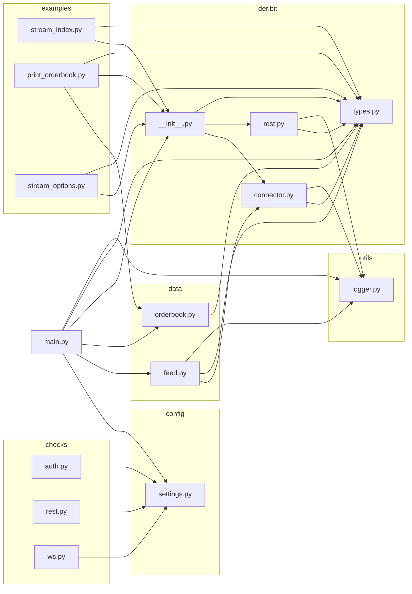

# Aletheia

A crypto market making system. The edge comes from disciplined quote placement — earning the bid-ask spread while managing inventory risk, adverse selection, and market impact.

## Strategy

Market making P&L decomposes into three components:

1. **Spread capture** — earned when both sides fill; the gross edge.
2. **Inventory cost** — mark-to-market loss when position drifts in the wrong direction.
3. **Adverse selection** — losses from trading against informed flow.

Quote placement follows the **Avellaneda-Stoikov** stochastic control framework. The reservation price adjusts for inventory risk; the spread adjusts for realised volatility and order arrival rate. Spreads widen dynamically with volatility, inventory imbalance, and flow toxicity signals (VPIN, order book imbalance).

## Architecture

```
config/      — settings and secrets (.env, dry_run flag)
exchange/    — venue connectors (native or CCXT-backed); all modules import from base.py only
data/        — WebSocket feed manager, L2 order book state, derived signals
core/        — quoting loop, pricing model, risk limits, portfolio/inventory state
execution/   — order management, fill reconciliation, P&L tracking
terminal/    — Textual TUI for live monitoring
utils/       — dependency-free helpers
```

The runtime is fully asyncio-native. The quoting loop is driven by order book update callbacks, not a timer. `dry_run = True` by default — orders are logged but never sent until `DRY_RUN=false` is set in the environment.

## Dependency Graph

Reflects actual internal imports in the current codebase (`core/`, `exchange/`, `execution/`, `terminal/` from the architecture above are not yet implemented — only `deribit/` exists as a live connector today).



## Venues

Any exchange accessible via CCXT (REST + WebSocket) or a native connector. Priority targets: Binance, OKX, Bybit — liquid spot and perpetual markets with viable maker fee structures.

## Stack

- Python 3.11+
- `ccxt` / `ccxt.pro` for exchange connectivity
- `aiohttp` + `websockets` for native connectors
- `numpy` / `pandas` for signal computation
- `orjson` for fast serialisation
- `textual` for the TUI
